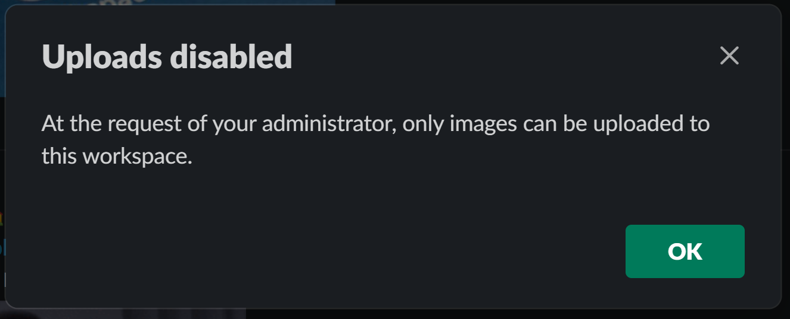

# Slack File Transfer Over Image Metadata

Slack has a number of controls which can be used to prevent users from
sharing potentially sensitive information over the platform. One of the
most commonly deployed ones is disabling file uploads:



Image uploads are handled differently, though, and often sharing pictures
is allowed even when arbitrary file uploads are not. Additionally, Slack
**preserves** image metadata when those are uploaded, including EXIF data
for JPEG files, and XMP frames in PNG files.

Because certain XMP frame types can be arbitrarily large, we can abuse
the metadata preservation ability to embedded file contents in images
share those over Slack.

## Pre-Requisites

```sh
$ sudo apt install libexempi3      # or the equivalent in your OS/Linux distro
$ pip install -r requirements.txt
```

## Usage

Embedding arbitrary files in image metadata is achieved via the
obviously named `embed.py` script:

```sh
$ python embed.py --input some-png-file.png \
    --output file-to-send-to-slack.png \
    file_to_embed.txt another_file_to_embed.pdf
```

The script will simply create a ZIP file embedding all the listed files,
encode it as base64 string and add it as a XMP frame to the input PNG
file. Once that's done, you should be able to uploaed the file as an
image to your Slack workspace.

Extracting the embedded content is just as simple: download the uploaded
image from SLack and just use the `extract.py` script:

```sh
$ python extract.py file-to-send-to-slack.png
```
